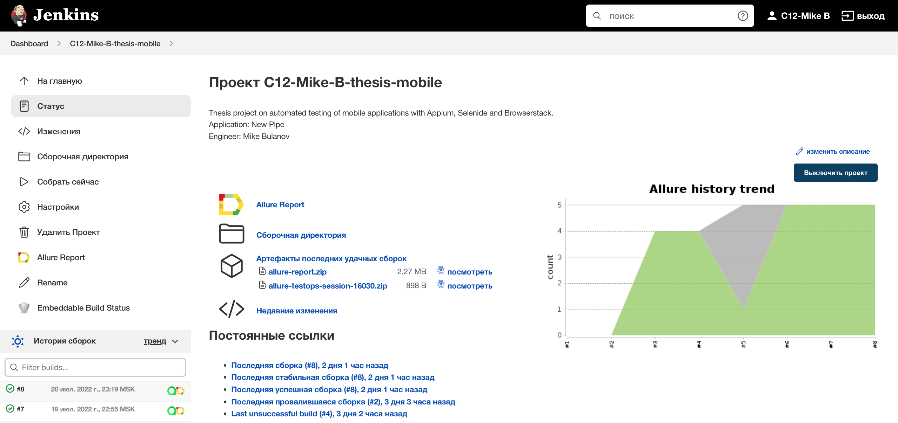
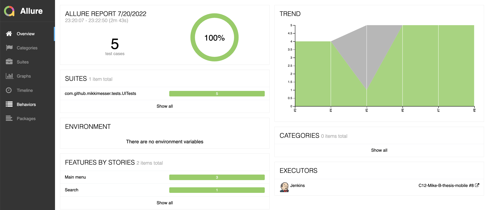
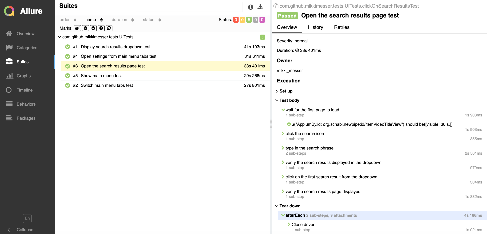
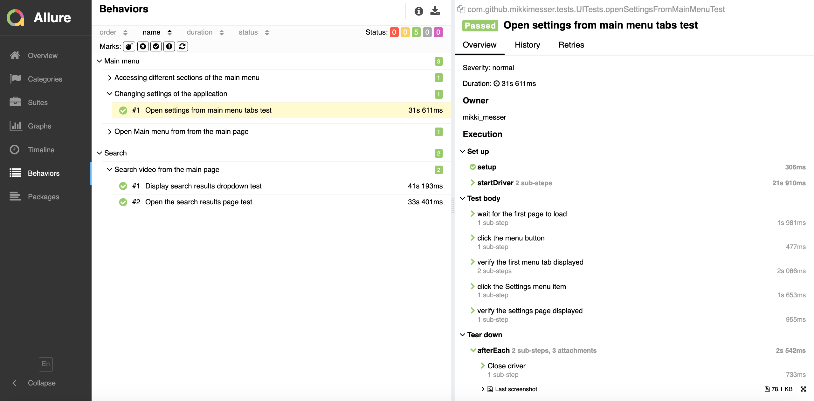
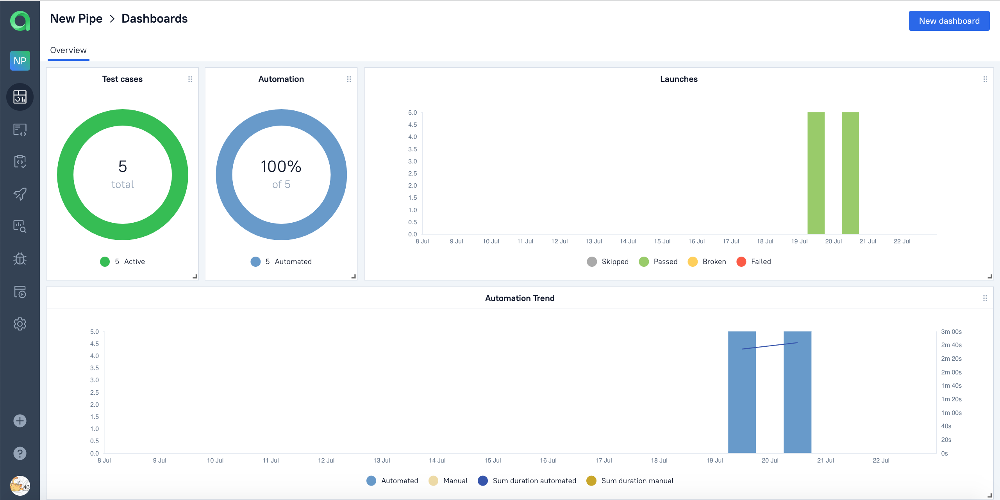
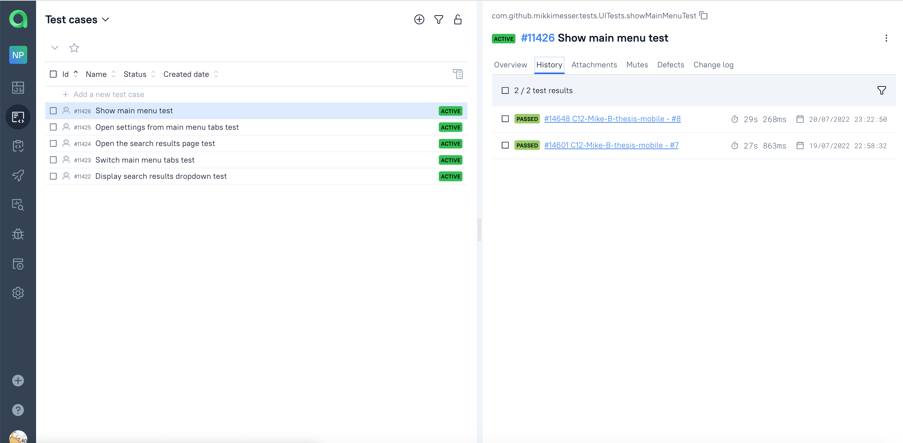
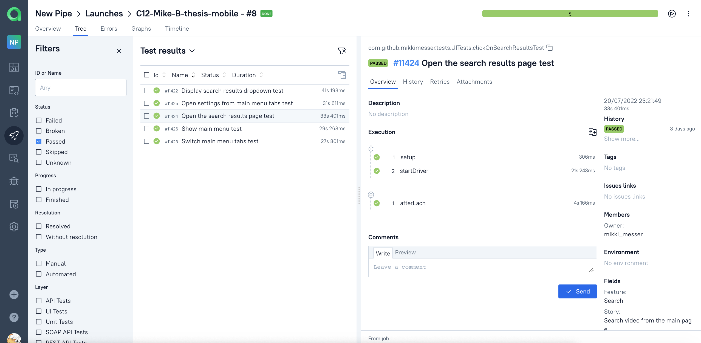
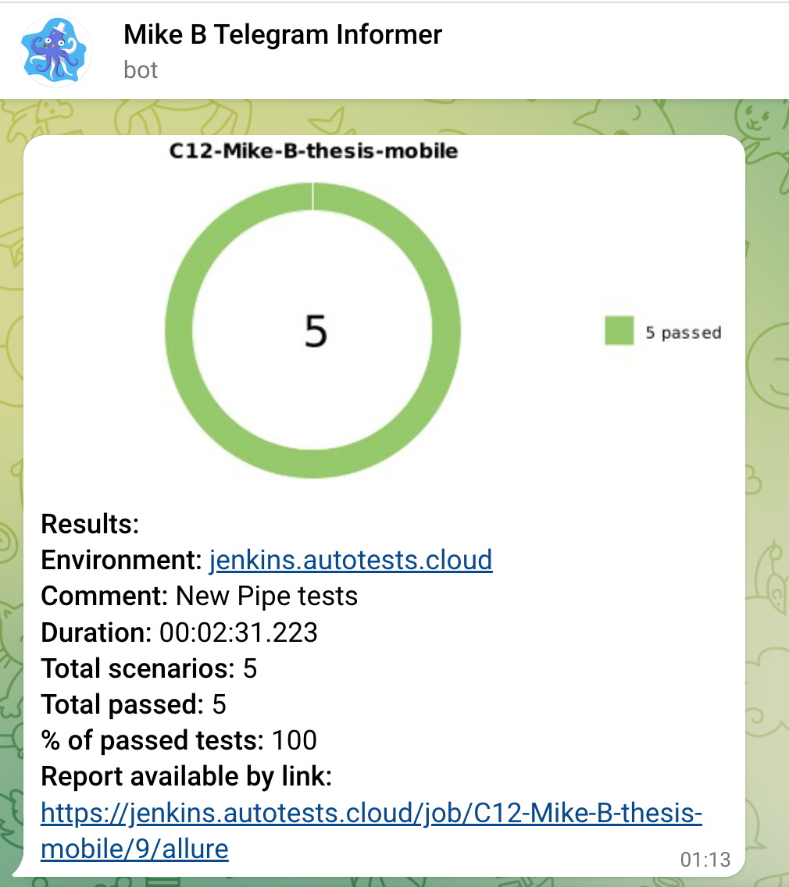
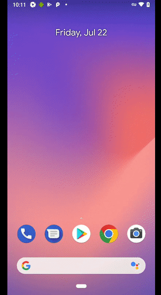

# Automated tests for the New Pipe Android application

## <a href = "https://newpipe.net/" target ="_blank">newpipe.net</a>

## :tv: Contents

- <a href="#tv-coverage">Coverage</a>
- <a href="#tv-technology-stack">Technology stack</a>
- <a href="#tv-prepare-test-data">Prepare test data</a>
- <a href="#tv-launch">Launch</a>
    - <a href="#how-to-launch-on-the-local-machine-with-tests-running-locally">How to launch on the local machine with tests running locally</a>
        - <a href="#launch-with-the-default-params">Launch with the default params</a>
        - <a href="#launch-with-the-arbitrary-params">Launch with the arbitrary params</a>
    - <a href="#how-to-launch-on-the-local-machine-with-tests-running-on-the-remote-server">How to launch on the local machine with tests running on the remote server</a>
        - <a href="#environment-properties-file-example">Environment .properties file example</a>
        - <a href="#launch-with-the-default-params-1">Launch with the default params</a>
        - <a href="#launch-with-the-arbitrary-params-1">Launch with the arbitrary params</a>
    - <a href="#how-to-launch-remotely-on-jenkins">How to launch remotely on Jenkins</a>
        - <a href="#environment-properties-file-example-1">Environment .properties file example</a>
        - <a href="#launch-with-the-arbitrary-params-on-Jenkins">Launch with the arbitrary params on Jenkins</a>
        - <a href="#tv-jenkins-build-example">Jenkins build example</a>
- <a href="#tv-allure-reports-integration">Allure reports integration</a>
    - <a href="#overview">Overview</a>
    - <a href="#test-suites">Test suites</a>
    - <a href="#behaviors">Behaviors</a>
- <a href="#tv-allure-testops-integration">Allure TestOps integration</a>
    - <a href="#dashboards">Dashboards</a>
    - <a href="#test-cases">Test cases</a>
    - <a href="#launches">Launches</a>
- <a href="#tv-telegram-notifications">Telegram Notifications</a>
- <a href="#tv-selenoid-launch-example">Selenoid launch example</a>

## :tv: Coverage

- Check that the "Join our team" link opens the "Jobs" page
- Check that the "News" link opens the "Blog & News" page
- Check that on scrolling down to the "100% Success Rate" block the lion widget appears
- Check that the lion widget disappears after the click on the close button
- Check that the contact card with links to the Facebook and LinkedIn appears on mouse hover over the first contact in
  the "Team block"
- Check that there are no errors in the browser console logs

## :tv: Technology stack

<p align="center">


</p>

## :tv: Prepare test data

The test data is passed via the `src/test/resources/configuration/testData.properties` file

Required test data:
- `search_phrase` - String. Required for the search tests. The phrase to search videos with.

## :tv: Launch

### How to launch on the local machine with tests running on the Android Studio Emulator

#### Prerequisites

Make sure to install Android Studio and Appium Server. Add the `.apk` file with the current version of the New Pipe app to the `src/test/resources/apps/` folder. 
At the moment of writing it is v 0.23.1.

#### Prepare the configuration file

Create the `emulation.properties` file in the `src/test/resources/configuration/` folder. 

#### Required parameters

`device` - The model of the emulated device.
`platform_name` - The platform name, Android.
`os_version` - The version of the device OS.
`app_package` - The application package. The value at the moment of writing is below.
`app_activity` - The main application package. The value at the moment of writing is below.
`app_url` -  The URL to download the current version of `.apk` file if it is missing in the `src/test/resources/configuration/` folder.
`app_path` - The path to the `.apk` file in the repository.
`appium_server_url` - The URL of the Appium server.

#### Emulation.properties file example

```
device=Pixel 4 API 30
platform_name=Android
os_version=11.0
app_package=org.schabi.newpipe
app_activity=org.schabi.newpipe.MainActivity
app_url=https://github.com/TeamNewPipe/NewPipe/releases/tag/v0.23.1
app_path=src/test/resources/apps/NewPipe_v0.23.1.apk
appium_server_url=http://localhost:4723/wd/hub
```

#### Command:

```
gradle clean test -"DdeviceHost=emulation"  
```

### How to launch on the local machine with tests running on Browserstack.com

#### Prerequisites

Make sure to register at browserstack.com, upload your `.apk` file to your dashboard, and get your credentials and browserstack link for the app.

#### Prepare the configuration file

Create the `browserstack.properties` file in the `src/test/resources/configuration/` folder.

#### Required parameters

`login` - The login to the Browserstack account.
`password` - The password to the Browserstack account.
`applId` - The link to the upload to the Browserstack apk.
`device` - The model of the emulated device.
`os_version` - The version of the device OS.
`url` - The URL of the Browserstack remote web driver.
`session_json_url` - The template of the URL of the session description on the Browserstack. Required to fetch the video URL.
`name` - Name of the session on the Browserstack.
`build` - Name of the build on the Browserstack.
`project` - Name of the project on Browserstack.

#### Browserstack.properties file example

```
login=myBrowserStackLogin
password=myBrowserStackPassword
applId=bs://myAwesomeBrowserstackLink
device=Google Pixel 3
os_version=9.0
url=http://hub.browserstack.com/wd/hub
session_json_url=https://api.browserstack.com/app-automate/sessions/%s.json
name=New Pipe v.0.23.1 appium tests
build=browserstack-build-2
project=new-pipe-mobile-tests
```

#### Command:

```
gradle clean test -"DdeviceHost=browserstack" 
```


### How to launch remotely on Jenkins

> Create the `testData.properties` file in the `src/test/resources/configuration/` folder following instructions from <a href="#tv-prepare-test-data">here</a>.
> Create the `browserstack.properties` file in the `src/test/resources/configuration/` folder following instructions from <a href="">here</a>

#### Command:

```
gradle clean test -"DdeviceHost=browserstack" 
```

## :tv: Jenkins build example

### <a target="_blank" href="https://jenkins.autotests.cloud/job/C12-Mike-B-thesis-mobile">Jenkins build</a>

<p align="center">

</p>

## :tv: Allure reports integration

### Overview

<p align="center">

</p>

### Test Suites

<p align="center">

</p>

### Behaviors

<p align="center">

</p>

## :tv: Allure TestOps integration

The Jenkins job automatically sends the results of the launch to the Allure TestOps.

### Dashboards

<p align="center">

</p>

### Test cases

<p align="center">

</p>

### Launches

<p align="center">

</p>

## :tv: Telegram Notifications

> <a href="https://github.com/qa-guru/allure-notifications">qa-guru/allure-notifications</a> is used

<p align="center">

</p>

## :tv: Browserstack launch example

There is a video for each test demonstrating the flow.

<p align="center">

</p>

